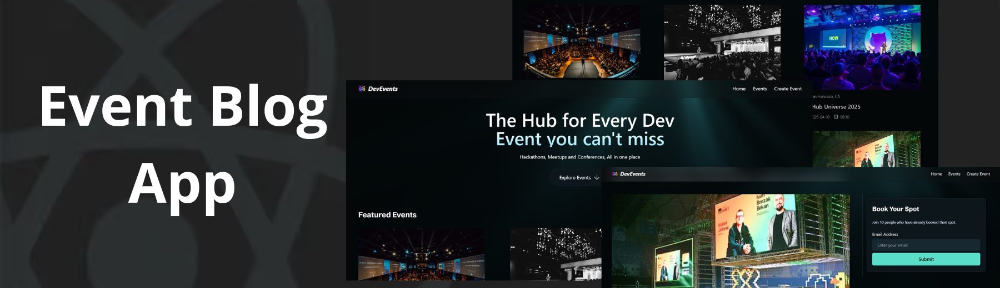

<div align="center">
  <br />
      
  <br />

  <div>
 
 

<br/>

 

 
 


  </div>

<h3 align="center">Event Blog App</h3>

</div>

## 📋 <a name="table">Table of Contents</a>

1. ✨ [Introduction](#introduction)
2. ⚙️ [Tech Stack](#tech-stack)
3. 🔋 [Features](#features)
4. 🤸 [Quick Start](#quick-start)


## <a name="introduction">✨ Introduction</a>

An event platform to manage and showcase events seamlessly, featuring dynamic listings, CRUD operations, Cloudinary image uploads, and analytics for engagement tracking.

## <a name="tech-stack">⚙️ Tech Stack</a>

- **[Cloudinary](https://jsm.dev/devevent-cloudinary)** is a cloud-based media management platform that simplifies image and video uploads, storage, optimization, and delivery. It helps developers manage media efficiently and improve website performance.

- **[CodeRabbit](https://coderabbit.link/JSMastery)** is a platform that accelerates development workflows by providing AI-powered coding assistance and project scaffolding, helping developers generate code and reduce repetitive tasks.

- **[MongoDB](https://www.mongodb.com/products/platform/atlas-database)** is a flexible, document-oriented NoSQL database that stores data in JSON-like format. It is ideal for modern applications that require scalability, high performance, and schema flexibility.

- **[Mongoose](https://mongoosejs.com/)** is an ODM (Object Data Modeling) library for MongoDB and Node.js. It provides a straightforward schema-based solution to model application data, validate inputs, and manage database interactions efficiently.

- **[Next.js](https://nextjs.org/docs)** is a powerful React framework for building full-stack web applications. It simplifies development with features like server-side rendering, static site generation, and API routes, enabling developers to focus on building products and shipping quickly.

- **[PostHog](https://jsm.dev/devevent-posthog)** is an open-source product analytics platform that tracks user interactions, funnels, and feature usage. It enables teams to understand user behavior, optimize features, and make data-driven decisions.

- **[Tailwind CSS](https://tailwindcss.com/)** is a utility-first CSS framework that allows developers to quickly build custom user interfaces with minimal custom CSS. It promotes consistency, responsiveness, and faster styling without leaving the HTML.

- **[TypeScript](https://www.typescriptlang.org/)** is a superset of JavaScript that adds static typing, providing better tooling, code quality, and error detection for developers. It is ideal for building large-scale applications and enhances the development experience.

- **[Warp](https://go.warp.dev/js-mastery)** is a modern terminal designed for speed, collaboration, and usability. It enhances developer productivity with features like smart commands, workflows, and session sharing.


## <a name="features">🔋 Features</a>

👉 **Home Page**: Displays a dynamic list of events, allowing users to browse upcoming and featured events easily.

👉 **API Routes**: Create, update, delete, and fetch events from the database with fully functional endpoints.

👉 **Cloudinary Integration**: Use the Cloudinary SDK to easily upload and manage images in the cloud.

👉 **Event Details Page**: Shows event information with the ability to register and view a list of similar events.

👉 **Next.js 16 Caching**: Implements a completely new approach to caching for improved performance and faster page loads.

👉 **PostHog Analytics**: Tracks user interactions and events, providing detailed insights into app usage and behavior.


And many more, including code architecture and reusability.

## <a name="quick-start">🤸 Quick Start</a>

Follow these steps to set up the project locally on your machine.

**Prerequisites**

Make sure you have the following installed on your machine:

- [Git](https://git-scm.com/)
- [Node.js](https://nodejs.org/en)
- [npm](https://www.npmjs.com/) (Node Package Manager)

**Cloning the Repository**

```bash
git clone https://github.com/shabuj-alam/event-blogs.git
cd event-blogs
```

**Installation**

Install the project dependencies using npm:

```bash
npm install
```

**Set Up Environment Variables**

Create a new file named `.env` in the root of your project and add the following content:

```env
NEXT_PUBLIC_BASE_URL=http://localhost:3000/

MONGODB_URI=

CLOUDINARY_URL=

NEXT_PUBLIC_POSTHOG_KEY=
NEXT_PUBLIC_POSTHOG_HOST=https://eu.i.posthog.com
```

Replace the placeholder values with your real credentials. You can get these here: [**Cloudinary**](https://jsm.dev/devevent-cloudinary), [**MongoDB**](https://www.mongodb.com/products/platform/atlas-database), [**PostHog**](https://jsm.dev/devevent-posthog).

**Running the Project**

```bash
npm run dev
```

Open [http://localhost:3000](http://localhost:3000) in your browser to view the project.
